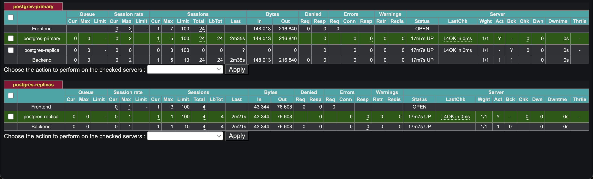
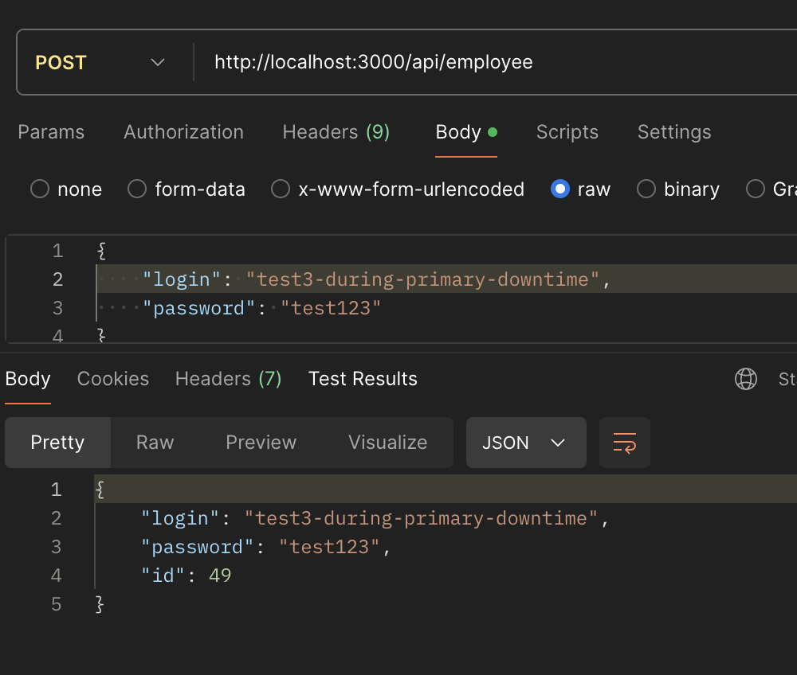

# Primary-secondary

## Primary down

#### 1. Initial: haproxy state (everything works)



#### 2. Stop primary

```
docker compose stop postgres-primary
```

Going down:


Stopped:


#### 3. Send API request right after stopping

Application experienced some downtime
```
Error: Connection terminated due to connection timeout
    at Client._connectionCallback (/Users/maksymnesterov/personal/highload-systems/highload-systems-lab05/node_modules/pg-pool/index.js:247:17)
    at Connection.<anonymous> (/Users/maksymnesterov/personal/highload-systems/highload-systems-lab05/node_modules/pg/lib/client.js:144:18)
    at Object.onceWrapper (node:events:632:28)
    at Connection.emit (node:events:518:28)
    at Socket.<anonymous> (/Users/maksymnesterov/personal/highload-systems/highload-systems-lab05/node_modules/pg/lib/connection.js:62:12)
    at Socket.emit (node:events:518:28)
    at TCP.<anonymous> (node:net:337:12)
```

#### 4. Replica automatically promoted to primary

Replica logs:
```
2025-04-03 00:25:57 INFO: executing notification command for event "standby_promote"
2025-04-03 00:25:57 DETAIL: command is:
2025-04-03 00:25:57   /opt/bitnami/repmgr/events/router.sh 2 standby_promote 1 "2025-04-02 21:25:57.963628+00" "server \"standby-2\" (ID: 2) was successfully promoted to primary"
2025-04-03 00:25:57 DEBUG: clear_node_info_list() - closing open connections
2025-04-03 00:25:57 DEBUG: clear_node_info_list() - unlinking
2025-04-03 00:25:57 [2025-04-02 21:25:57] [NOTICE] node 2 has recovered, reconnecting
2025-04-03 00:25:58 [2025-04-02 21:25:58] [NOTICE] monitoring cluster primary "standby-2" (ID: 2)
```

#### 5. DB cluster ready and application works

Main port `5010` (from haproxy) accepts connections and is available for read and write. 

POST api requests are working as usual




#### 6. Primary up

```
docker compose up -d postgres-primary
```

Starting:


Started:


#### 7. Data restored

Written data during primary downtime successfully restored in primary


## Secondary down

#### 1. Initial: haproxy state (everything works)


#### 2. Stop replica

```
docker compose stop postgres-replica
```


#### 3. Send API request right after stopping

This time application did not experience any downtime

#### 4. Replica automatically promoted to primary

Primary logs:
```
2025-04-03 00:59:59 [2025-04-02 21:59:59] [NOTICE] standby node "standby-2" (ID: 2) has disconnected
```

#### 5. DB cluster ready and application works

Main port `5010` (from haproxy) accepts connections and is available for read and write. 

POST api requests are working as usual


#### 6. Replica up

```
docker compose up -d postgres-replica
```


#### 7. Data restored

Written data during primary downtime successfully restored in primary


